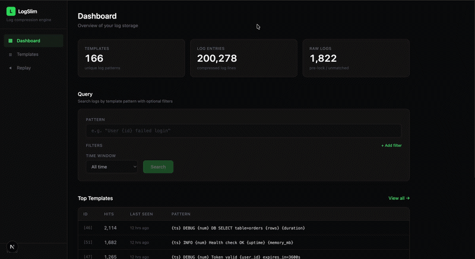

# LogSlim

**Structured, queryable logs your AI agent can actually read — losslessly, at up to 80% less storage.**

LogSlim turns unstructured log streams into **structured templates + parameters** automatically — no regex, no grok, no SDK. That structure is the point: it lets an AI agent investigate a service by reasoning over a few dozen *templates and their distributions* instead of drowning in (and paying for) millions of raw lines. LogSlim exposes this to agents through a built-in **MCP server**.

As a side effect of separating templates from parameters, the same data stores in compressed Parquet at up to **80% less space** — and every original line is still exactly reconstructable.

Lossless. Sits in front of your existing storage. No agent, no SDK changes, no vendor lock-in.

---



---

## Why structure, not raw lines

A busy service emits millions of log lines an hour. You cannot hand those to an LLM agent during an incident:

- it doesn't fit a context window,
- it costs a fortune per glance, and
- the one line that matters is buried among thousands of near-duplicates (the "lost in the middle" problem).

LogSlim collapses that firehose into **templates + counts + per-slot distributions**, *losslessly*. An agent then investigates the way a human SRE does — **overview → anomaly → drill → raw** — and pulls exact log lines only for the narrow window it actually needs.

On the included `incident.log` (13,728 lines of a real DB-pool-exhaustion cascade), the parser extracts **91 templates, the top 15 of which cover 90% of the volume — with 100% of lines structured**. A whole-service overview is a couple thousand tokens instead of ~400k of raw text, and the root-cause chain (deploy → dropped index → SeqScan → pool exhaustion → OOM → circuit breaker) surfaces at the *top* of the anomaly list rather than as a needle in a haystack.

---

## How It Works

```
Raw log line:  "2024-01-15 10:23:45 DEBUG 1234 DB SELECT table=sessions req-755556 12ms"
               ↓  universal masking + learned variables
Template:      "{ts} DEBUG {num} DB SELECT table=sessions {var} {size}"
Parameters:    ["2024-01-15 10:23:45", "1234", "req-755556", "12ms"]
```

1. **Universal masking** (`EntityMasker`) replaces dataset-independent syntax — timestamps, IPs, UUIDs, paths, hex, sizes, numbers — in a single deterministic pass over the whole line, including entities glued mid-token (`10.0.0.1:50010:Got`). The masked shape is the template key: every line gets a template, deterministically, independent of input order.

2. **Learned variables** (`TemplateLearner`) discover each dataset's own ID species (session IDs, container names, request tokens) statistically from the corpus: a token position that varies across otherwise-identical shapes becomes a `{var}` slot only when its cardinality is high *and* its values look like identifiers — so `succeeded` vs `failed` stays two templates while `req-755556` collapses into one. No per-dataset regexes, no configuration; the template set is a pure function of the data.

3. **Storage** separates templates from parameters. A template seen 5,000 times is stored once; only the variable values per occurrence are stored. DuckDB's columnar encoding + zstd compression handles the rest. Reconstruction is byte-exact — a line that wouldn't round-trip is kept verbatim in `raw_logs` (in practice: 0 lines on every validated dataset).

4. **`logslim compact`** exports `log_entries` and `raw_logs` to Parquet files and replaces the tables with `UNION ALL` views. The database stays queryable after compaction.

---

## For AI agents — the MCP server

LogSlim ships an [MCP](https://modelcontextprotocol.io) server (`mcp/`) that exposes the structured-log API to agents (Claude Code/Desktop, Cursor, …) as **atomic, composable tools**. There is no opaque "answer" call — the agent composes the investigation, and each step ships *structure*, not raw text.

| Tool | Cost | Role | Returns |
|------|------|------|---------|
| `list_templates`, `get_stats` | low | orient | the service's behavior as patterns + counts |
| `template_counts` | low | detect | per-template counts in a window (`baseline=true` → window-vs-baseline ratios in one call) |
| `new_templates` | low | detect | templates first seen (by log-event time) in a window — likely triggers |
| `template_timeseries` | low | localize | bucketed counts for one template → pinpoint the onset minute |
| `inspect_template` | low | drill | per-slot **distributions + numeric summaries** (min/max/avg/p50/p95), no rows pulled |
| `query_logs` | low–med | drill | occurrences as **template once + parameter tuples** (projectable to specific columns) |
| `raw_sample` | med | drill | a sample of unmatched/novel raw lines |
| `replay` | **high** | raw | exact original lines for a **narrow** window — the lossless escape hatch |

**Structure over text, by default.** `query_logs` returns the template once plus per-occurrence parameter tuples instead of repeating the static line skeleton on every row, and `inspect_template` answers "which values / how many / what distribution" from aggregates without pulling any occurrences. Measured on `incident.log`, 200 matches of one template cost ~3.1k tokens structured (vs ~6.8k as reconstructed text), or ~1k projected to a single field. Server `instructions` and an `investigate_incident` prompt steer the agent down this cost ladder — aggregates first, raw lines last.

### Setup

```bash
# 1. start the API the MCP server talks to
logslim serve                       # → http://localhost:8080

# 2. build the MCP server
cd mcp && npm install && npm run build

# 3. register it with your agent (Claude Code shown)
claude mcp add logslim -- node "$(pwd)/dist/index.js"
```

Configure via `LOGSLIM_API_URL` (default `http://localhost:8080`) and optional `LOGSLIM_API_KEY`. See [`mcp/README.md`](mcp/README.md) for the full tool reference and a no-agent smoke test.

---

## Installation

**Requirements:** Java 17+, Node.js 18+ (dashboard and MCP server only)

```bash
# Build from source
git clone https://github.com/mihirrd/logslim
cd logslim
mvn clean package -q
alias logslim="java -jar $(pwd)/target/logslim-1.1.0.jar"
```

By default LogSlim reads and writes `logs.duckdb` in the current directory. Override with `-Dlogslim.db.path=`:

```bash
java -Dlogslim.db.path=/var/log/myapp.duckdb -jar logslim-1.1.0.jar run --input <file>
```

---

## Docker

```bash
docker pull mihirrd/logslim:latest        # pin a version in production, e.g. :1.3.0
```

LogSlim stores state in a DuckDB file and a Parquet data directory. Mount a host directory so data persists across container restarts, and set up an alias to avoid the `docker run` boilerplate:

```bash
mkdir -p ./data
alias logslim='docker run --rm -v $(pwd)/data:/data mihirrd/logslim:latest'
```

All examples below assume this alias. The database is written to `./data/logs.duckdb` on the host.

### Ingest a log file

```bash
cp /var/log/app.log ./data/          # the file must be inside the mounted volume
logslim run --input /data/app.log
```

### Compact to Parquet

```bash
logslim compact --yes
```

Exports all data to `/data/logs_data/` as compressed Parquet and shrinks the `.duckdb` file to metadata only. Run periodically to reclaim disk.

### Start the API server

```bash
docker run --rm -v $(pwd)/data:/data -p 8080:8080 mihirrd/logslim:latest serve
```

The dashboard at `http://localhost:3000` and the MCP server connect to this.

### Continuous ingestion from Kafka

```bash
docker run --rm -v $(pwd)/data:/data --network host mihirrd/logslim:latest \
  consume --topic app-logs --bootstrap-servers localhost:9092 \
  --batch-size 5000 --flush-interval PT5S --compact-interval PT10M
```

If Kafka runs in another container, connect them via a shared `--network` and use the Kafka container name as the bootstrap host.

---

## CLI

```bash
# Templates — the structured overview
logslim templates --limit 10
logslim templates --search "failed login"
logslim templates --last 1h --limit 5

# Inspect a template: per-slot value stats + recent reconstructed lines
logslim inspect <template-id> --recent 10

# Query by pattern, filter by slot value (indexed lookup, not a text scan)
logslim query "User {id} failed login" --last 24h
logslim query "User {id} failed login" --filter id=456 --last 24h

# Replay exact original lines (lossless)
logslim replay --last 1h
logslim replay --from 2024-01-15T00:00:00Z --to 2024-01-15T23:59:59Z
```

---

## Web Dashboard

A Next.js dashboard for exploring logs without the CLI.

```bash
logslim serve                                   # Terminal 1 → :8080
cd dashboard && npm install && npm run dev      # Terminal 2 → :3000
```

It exposes storage stats, template search with hit counts, per-slot inspection, pattern query with "did you mean?" suggestions, anomalies, relative/absolute replay, browser ingest, and compaction — all over the same API the MCP server uses.

The server reads only the compacted Parquet snapshot in `logs_data/`, so `logslim serve` can run concurrently with `logslim run` / `logslim consume` (the writer owns `logs.duckdb`). It auto-bootstraps an empty snapshot on first startup and sees new data after each `compact`.

---

## Compression — the enabling mechanism

The same template/parameter separation that makes logs cheap to feed an agent also makes them cheap to store. Real numbers from a single Apple Silicon laptop (Java 17, DuckDB 1.1.3); reproducible via `benchmarks/run_all.sh`.

### 100,000 synthetic log lines, 10 templates, ~7 MB raw

| Stage | Size |
|---|---|
| Source `.log` file | 7.30 MB |
| After ingest (`.duckdb`) | 16.26 MB |
| After `compact` (`.duckdb` + Parquet) | **1.71 MB** |
| Reduction vs source | **76.5%** |

Compression improves with log repetition — fewer distinct templates compress further as DuckDB's dictionary encoding on `template_id` gets more efficient.

| Log file | Original | After compact | Reduction |
|----------|----------|---------------|-----------|
| `app_logs.log` (100k lines) | 7.35 MB | 1.49 MB | 80% |
| `app.log` (100k lines) | 9.10 MB | 1.71 MB | 81% |

---

## Key Properties

**Structure-first** — logs become templates + parameters + distributions, queryable as data and consumable by agents as a few thousand tokens instead of millions of raw lines.

**Lossless** — every line is exactly reconstructable. Multi-line entries (stack traces, `Caused by:` chains) are stored and replayed intact.

**Zero configuration** — no per-dataset regex patterns. Universal syntax is masked deterministically; everything else that varies is learned from the data itself.

**Queryable after compression** — `compact` replaces tables with DuckDB views over Parquet. All query commands work without decompressing anything.

**Transparent** — a preprocessing layer. Feed it logs, query them back. No changes to your application or log format.

---

## Contributing

Pull requests welcome. Before submitting:

```bash
mvn clean test   # all tests must pass
```

The suite covers masking and learning correctness (split-vs-merge decisions, byte-exact round-trips through merged templates, determinism), the end-to-end pipeline, lossless reconstruction including multi-line entries, parameter filtering, and temporal ordering. For new features, add integration tests in `src/test/java/com/logslim/integration/` that verify the invariants that matter most: **losslessness**, **correct grouping**, and **temporal order**. Open an issue first for large changes.

---

## License

MIT — see [LICENSE](LICENSE).
